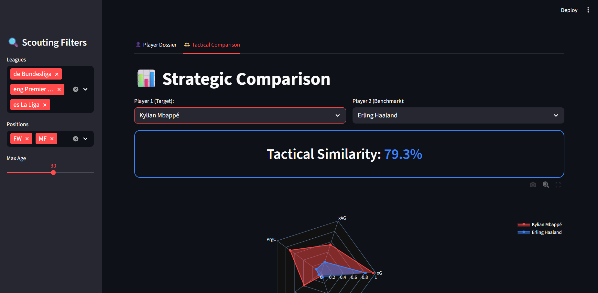

# ⚽ Scout-Agent AI: 2024-2025 Elite Technical Auditor
Developped by : Aqdora Israa

### **Scout-Agent AI** is a professional-grade football scouting platform designed for the 2026 recruitment window. By combining **Machine Learning** (Tactical Similarity) with a **Local AI Agent (LLM)**, it transforms raw 24/25 season stats into clinical, high-impact scouting dossiers.
---

## 🌟 Elite Features

* **Clinical Efficiency Audit:** Performs a mathematical deep-dive into finishing sustainability by calculating the "Efficiency Delta" between actual goals and Expected Goals (xG).
* **On-Premise AI Architecture:** Integrated with **Ollama (Llama 3.2)**. No data leaves your machine, ensuring 100% privacy and zero reliance on external API costs or quotas.
* **Tactical DNA Interpretation:** The agent identifies player archetypes (e.g., "Clinical Finisher", "Target Reference") and evaluates defensive trade-offs versus offensive output.
* **Similarity Matching Engine:** Utilizes a **Cosine Similarity** algorithm to find "statistical twins" across top leagues with a precise match percentage.

---

## 📊 Dataset Analysis & Description

The technical foundation of this project is built upon a high-granularity performance dataset for the 2024-2025 season.

### 1. Data Architecture
* **Source:** Primary metrics are extracted from `players_data_light-2024_2025.csv`.
* **Sample Integrity:** Audit reports are generated based on significant playing time, typically utilizing a 2736-minute sample size for elite profiles to ensure statistical significance.
* **Feature Engineering:** Raw CSV data is normalized and filtered into a "Technical Dossier" to provide the LLM with structured context.

### 2. Key Metrics Analyzed
The agent evaluates the following feature sets to derive tactical insights:
* **Finishing Suite:** Goals vs. xG (Expected Goals) to measure clinical efficiency.
* **Creativity Suite:** Assists vs. xAG (Expected Assisted Goals) to assess chance creation quality.
* **Progression Suite:** Progressive Passes (PrgP) and Progressive Carries (PrgC) to identify "Drivers" in the build-up phase.
* **Defensive Suite:** Tackles (Tkl) and Interceptions (Int) to calculate work-rate vs. offensive load trade-offs.

### 3. Tactical Logic
The dataset allows the AI to distinguish between archetypes based on distribution. For example, a high Goal-to-Assist ratio combined with low defensive volume identifies a **"Pure Target Man"**, whereas high PrgP/PrgC volume identifies a **"Creative Pivot"**.

---

## 🛠️ Technical Stack

* **Frontend:** Streamlit (Interactive Scouting Dashboard).
* **Data Science:** Pandas (ETL) & Scikit-Learn (Similarity Matrix).
* **IA Inference:** LangChain & Ollama (Llama 3.2 3B).
* **Analytical Rigor:** Configured with `temperature: 0.0` for zero-hallucination, fact-based reporting.

---

## 🚀 Quick Start

### 1. Prerequisites
* Install [Ollama](https://ollama.com/).
* Pull the model: `ollama run llama3.2`.

### 2. Installation
```bash
git clone [https://github.com/aqdoraisraa-i/scout-agent-ai.git]
pip install -r requirements.txt
streamlit run app.py
```

---


## 📊 Strategic Comparison Dashboard example


*Figure 1: Side-by-side radar chart comparison and statistical similarity scoring between elite profiles.*


---


## 📊 Player Audit example

*Figure 2: Julián Álvarez Audit*


*Figure 2: Julián Álvarez Audit*


---


## 🔒 Privacy & Resilience
This project successfully migrated from Cloud-based LLMs to a **Local LLM architecture**, solving "Resource Exhausted" errors (API 429) and ensuring sensitive scouting data remains strictly offline and secure.


## 📬 Contact & Portfolio
Created by Aqdora Israa - .
LinkedIn : Aqdora Israa
*Built for the next generation of Data-Driven Directors of Football.*
