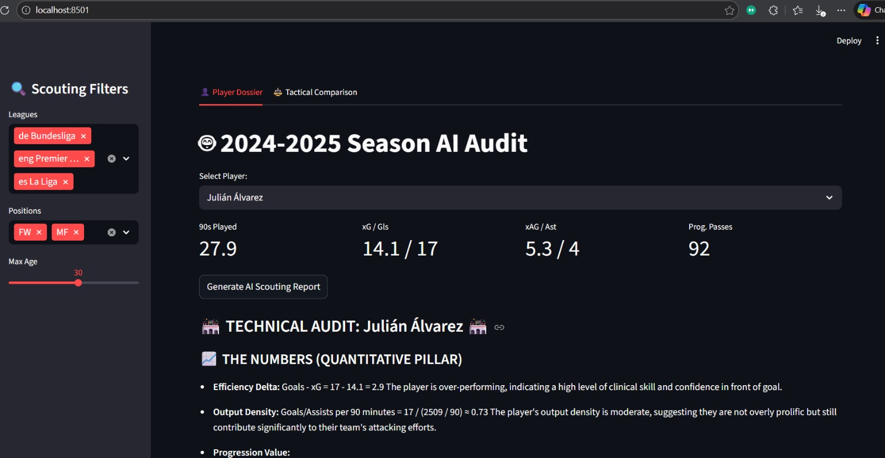
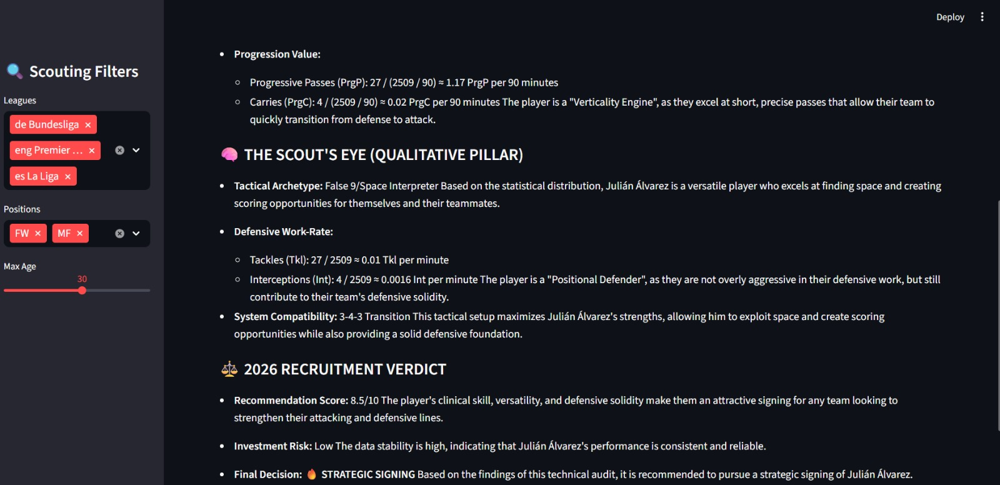

<<<<<<< HEAD
# ⚽ Scout-Agent AI: Advanced Football Recruitment Intelligence

**Scout-Agent AI** is a professional-grade technical scouting platform designed for the 2026 Winter Transfer Window. By integrating **Generative AI (Gemini 2.0 Flash)** with **Advanced Data Science**, it transforms raw FBref performance data from the 2024-2025 season into actionable recruitment dossiers.

---

## 🚀 Core Functionalities

### 1. AI-Driven Performance Audits
The platform doesn't just show numbers; it interprets them. The AI Agent analyzes:
* **Efficiency Delta:** Comparing actual goals and assists against xG and xAG to identify clinical finishers vs. lucky streaks.
* **Tactical Sustainability:** Evaluating if a player's physical workload (minutes/starts) is sustainable for a top-tier club.

### 2. Tactical Similarity Engine (Statistical Twin Finder)
Leveraging **Cosine Similarity** algorithms, the dashboard calculates a "Tactical Match Score." 
* **Use Case:** If your primary target is unavailable, the engine identifies players with the most similar statistical "fingerprint" across progressive passing, carries, and defensive volume.

### 3. Multidimensional Radar Profiles
Interactive visualizations that normalize player performance against league maximums. 
* **Metrics:** xG, xAG, Progressive Carries, Progressive Passes, and Defensive Actions (Tkl+Int).


---

## 📂 Data & Methodology

### Timeframe: The 2024-2025 "Golden Season"
The data used represents the **full, completed 2024-2025 campaign** across the European "Big 5" leagues:
* 🏴󠁧󠁢󠁥󠁮󠁧󠁿 **Premier League**
* 🇪🇸 **La Liga**
* 🇮🇹 **Serie A**
* 🇩🇪 **Bundesliga**
* 🇫🇷 **Ligue 1**

### The Tech Stack
* **LLM:** Google Gemini 2.0 Flash (via LangChain).
* **Similarity Logic:** Scikit-Learn `cosine_similarity`.
* **Frontend:** Streamlit.
* **Data Processing:** Pandas & NumPy.
* **Visualization:** Plotly Linear Polar Charts.

---

## 🛠️ Installation & Setup

### Prerequisites
* Python 3.9+
* Google AI Studio API Key (Gemini API)

### Step-by-Step
1.  **Clone the Repository**
    ```bash
    git clone [https://github.com/yourusername/scout-agent-ai.git](https://github.com/yourusername/scout-agent-ai.git)
    cd scout-agent-ai
    ```
2.  **Install Requirements**
    ```bash
    pip install -r requirements.txt
    ```
3.  **Environment Variables**
    Create a `.env` file in the root directory:
    ```env
    GOOGLE_API_KEY=your_api_key_here
    ```
4.  **Run the Application**
    ```bash
    streamlit run app.py
    ```

---

## 🔍 Discovery Interface
The sidebar allows for deep-dive scouting using three main vectors:
1.  **League Filter:** Focus on specific tactical environments (e.g., the physicality of the Premier League).
2.  **Position Filter:** Narrow down to `FW`, `MF`, `DF`, or `GK`.
3.  **Age/Availability Slider:** Filter by player age and total minutes played to ensure target reliability.

=======
# ⚽ Scout-Agent AI: 2024-2025 Elite Technical Auditor
Developped by : Aqdora Israa

**Scout-Agent AI** is a professional-grade football scouting platform designed for the 2026 recruitment window. By combining **Machine Learning** (Tactical Similarity) with a **Local AI Agent (LLM)**, it transforms raw 24/25 season stats into clinical, high-impact scouting dossiers.

---

## 🌟 Elite Features

* **Clinical Efficiency Audit:** Performs a mathematical deep-dive into finishing sustainability by calculating the "Efficiency Delta" between actual goals and Expected Goals (xG).
* **On-Premise AI Architecture:** Integrated with **Ollama (Llama 3.2)**. No data leaves your machine, ensuring 100% privacy and zero reliance on external API costs or quotas.
* **Tactical DNA Interpretation:** The agent identifies player archetypes (e.g., "Clinical Finisher", "Target Reference") and evaluates defensive trade-offs versus offensive output.
* **Similarity Matching Engine:** Utilizes a **Cosine Similarity** algorithm to find "statistical twins" across top leagues with a precise match percentage.

---

## 📊 Dataset Analysis & Description

The technical foundation of this project is built upon a high-granularity performance dataset for the 2024-2025 season.

### 1. Data Architecture
* **Source:** Primary metrics are extracted from `players_data_light-2024_2025.csv`.
* **Sample Integrity:** Audit reports are generated based on significant playing time, typically utilizing a 2736-minute sample size for elite profiles to ensure statistical significance.
* **Feature Engineering:** Raw CSV data is normalized and filtered into a "Technical Dossier" to provide the LLM with structured context.

### 2. Key Metrics Analyzed
The agent evaluates the following feature sets to derive tactical insights:
* **Finishing Suite:** Goals vs. xG (Expected Goals) to measure clinical efficiency.
* **Creativity Suite:** Assists vs. xAG (Expected Assisted Goals) to assess chance creation quality.
* **Progression Suite:** Progressive Passes (PrgP) and Progressive Carries (PrgC) to identify "Drivers" in the build-up phase.
* **Defensive Suite:** Tackles (Tkl) and Interceptions (Int) to calculate work-rate vs. offensive load trade-offs.

### 3. Tactical Logic
The dataset allows the AI to distinguish between archetypes based on distribution. For example, a high Goal-to-Assist ratio combined with low defensive volume identifies a **"Pure Target Man"**, whereas high PrgP/PrgC volume identifies a **"Creative Pivot"**.

---

## 🛠️ Technical Stack

* **Frontend:** Streamlit (Interactive Scouting Dashboard).
* **Data Science:** Pandas (ETL) & Scikit-Learn (Similarity Matrix).
* **IA Inference:** LangChain & Ollama (Llama 3.2 3B).
* **Analytical Rigor:** Configured with `temperature: 0.0` for zero-hallucination, fact-based reporting.

---

## 🚀 Quick Start

### 1. Prerequisites
* Install [Ollama](https://ollama.com/).
* Pull the model: `ollama run llama3.2`.

### 2. Installation
```bash
git clone [https://github.com/aqdoraisraa-i/scout-agent-ai.git]
pip install -r requirements.txt
streamlit run app.py
```

---


## 📊 Strategic Comparison Dashboard example


*Figure 1: Side-by-side radar chart comparison and statistical similarity scoring between elite profiles.*
>>>>>>> 9f33e68 (feat: migrate to local Llama 3.2 via Ollama & update tactical README)


---

<<<<<<< HEAD
## ⚖️ Disclaimer & Usage
This tool is built for recruitment analysts and technical directors. The "Verdict" generated by the AI is based on 2024-2025 performance data and should be used as a secondary confirmation tool alongside traditional video scouting.

---

## 📬 Contact & Portfolio
Created by Aqdora Israa - Professional Data Analyst & Football Enthusiast.
LinkedIn : Aqdora Israa
=======

## 📊 Player Audit example

*Figure 2: Julián Álvarez Audit*


*Figure 2: Julián Álvarez Audit*


---


## 🔒 Privacy & Resilience
This project successfully migrated from Cloud-based LLMs to a **Local LLM architecture**, solving "Resource Exhausted" errors (API 429) and ensuring sensitive scouting data remains strictly offline and secure.

*Built for the next generation of Data-Driven Directors of Football.*
>>>>>>> 9f33e68 (feat: migrate to local Llama 3.2 via Ollama & update tactical README)
